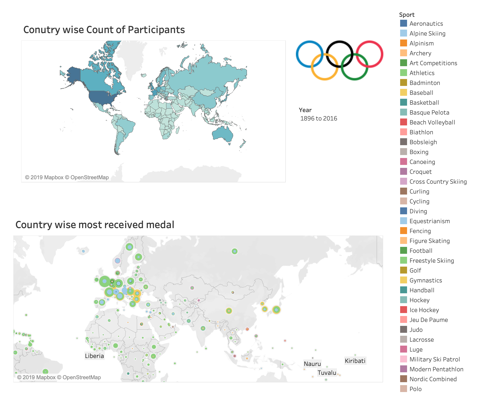
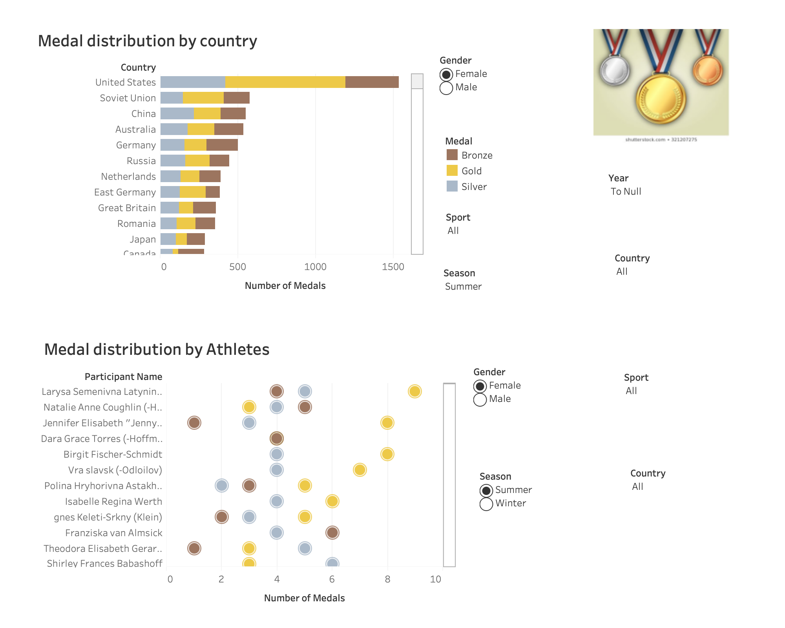
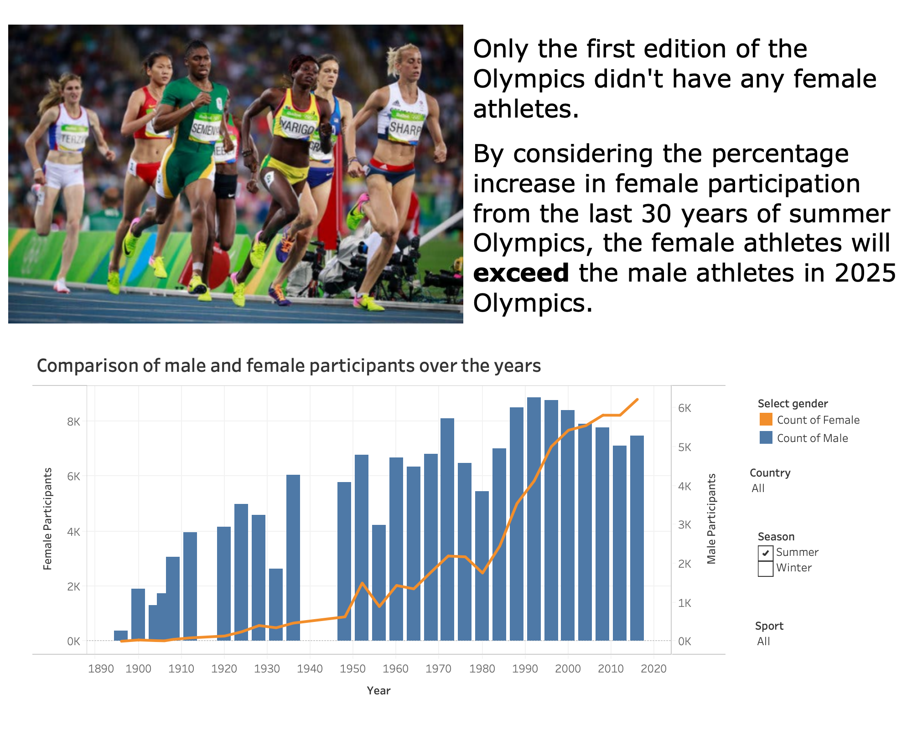
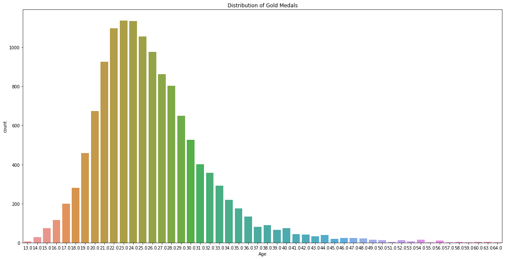
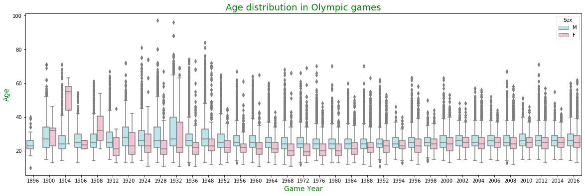
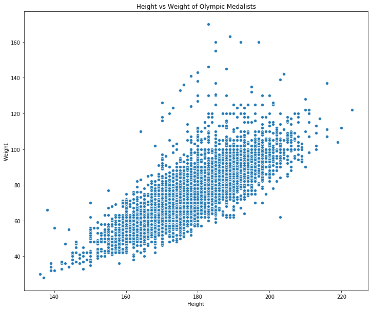

Data Visualizations
==============================

Story telling and visualization to describe the 120 years of Olympics data, dating from 1896 to 2016.

For the analysis, **"Jupyter notebooks"** and **"Tableau**" are used.
  
Data sets are collected from previous project "Jimmy Wrangler - Data Exploration" 
[here](https://github.com/mugdhabajjuri/Datascience1)

# Story telling and visualizations in Tableau

### Conutry wise Count of Participants and Country wise most received medal



### Medal distribution by country and Medal distribution by Athletes



### Comparison of male and female participants over the years



# Story telling and visualizations in Jupyter Notebook


## Distribution of the age of gold medalists





### There are people who have won gold medals with Age greater than 50 😲😲😲

#### let's see how many people won gold medals after turning 50 🏅


```python
goldMedals['ID'][goldMedals['Age'] > 50].count()
```


    65


### 🕕🕔 people!!!  That's great

### Let's dive deep into age of the olympic participants





### Two things to observe here :
#### - There are participants, whose age is over 80 👏
#### - In 1904 female age distribution is strongly different from the other Olympics


```python
data.loc[data['Age'] > 80].head(10)
```


<table border="1" class="dataframe">
  <thead>
    <tr style="text-align: right;">
      <th></th>
      <th>ID</th>
      <th>Name</th>
      <th>Sex</th>
      <th>Age</th>
      <th>Height</th>
      <th>Weight</th>
      <th>Team</th>
      <th>NOC</th>
      <th>Games</th>
      <th>Year</th>
      <th>Season</th>
      <th>City</th>
      <th>Sport</th>
      <th>Event</th>
      <th>Medal</th>
    </tr>
  </thead>
  <tbody>
    <tr>
      <th>9371</th>
      <td>5146</td>
      <td>George Denholm Armour</td>
      <td>M</td>
      <td>84.0</td>
      <td>NaN</td>
      <td>NaN</td>
      <td>Great Britain</td>
      <td>GBR</td>
      <td>1948 Summer</td>
      <td>1948</td>
      <td>Summer</td>
      <td>London</td>
      <td>Art Competitions</td>
      <td>Art Competitions Mixed Painting, Unknown Event</td>
      <td>NaN</td>
    </tr>
    <tr>
      <th>60861</th>
      <td>31173</td>
      <td>Thomas Cowperthwait Eakins</td>
      <td>M</td>
      <td>88.0</td>
      <td>NaN</td>
      <td>NaN</td>
      <td>United States</td>
      <td>USA</td>
      <td>1932 Summer</td>
      <td>1932</td>
      <td>Summer</td>
      <td>Los Angeles</td>
      <td>Art Competitions</td>
      <td>Art Competitions Mixed Painting, Unknown Event</td>
      <td>NaN</td>
    </tr>
    <tr>
      <th>60862</th>
      <td>31173</td>
      <td>Thomas Cowperthwait Eakins</td>
      <td>M</td>
      <td>88.0</td>
      <td>NaN</td>
      <td>NaN</td>
      <td>United States</td>
      <td>USA</td>
      <td>1932 Summer</td>
      <td>1932</td>
      <td>Summer</td>
      <td>Los Angeles</td>
      <td>Art Competitions</td>
      <td>Art Competitions Mixed Painting, Unknown Event</td>
      <td>NaN</td>
    </tr>
    <tr>
      <th>60863</th>
      <td>31173</td>
      <td>Thomas Cowperthwait Eakins</td>
      <td>M</td>
      <td>88.0</td>
      <td>NaN</td>
      <td>NaN</td>
      <td>United States</td>
      <td>USA</td>
      <td>1932 Summer</td>
      <td>1932</td>
      <td>Summer</td>
      <td>Los Angeles</td>
      <td>Art Competitions</td>
      <td>Art Competitions Mixed Painting, Unknown Event</td>
      <td>NaN</td>
    </tr>
    <tr>
      <th>98118</th>
      <td>49663</td>
      <td>Winslow Homer</td>
      <td>M</td>
      <td>96.0</td>
      <td>NaN</td>
      <td>NaN</td>
      <td>United States</td>
      <td>USA</td>
      <td>1932 Summer</td>
      <td>1932</td>
      <td>Summer</td>
      <td>Los Angeles</td>
      <td>Art Competitions</td>
      <td>Art Competitions Mixed Painting, Unknown Event</td>
      <td>NaN</td>
    </tr>
    <tr>
      <th>154855</th>
      <td>77710</td>
      <td>Robert Tait McKenzie</td>
      <td>M</td>
      <td>81.0</td>
      <td>NaN</td>
      <td>NaN</td>
      <td>Canada</td>
      <td>CAN</td>
      <td>1948 Summer</td>
      <td>1948</td>
      <td>Summer</td>
      <td>London</td>
      <td>Art Competitions</td>
      <td>Art Competitions Mixed Sculpturing, Unknown Event</td>
      <td>NaN</td>
    </tr>
    <tr>
      <th>236912</th>
      <td>118789</td>
      <td>Louis Tauzin</td>
      <td>M</td>
      <td>81.0</td>
      <td>NaN</td>
      <td>NaN</td>
      <td>France</td>
      <td>FRA</td>
      <td>1924 Summer</td>
      <td>1924</td>
      <td>Summer</td>
      <td>Paris</td>
      <td>Art Competitions</td>
      <td>Art Competitions Mixed Sculpturing</td>
      <td>NaN</td>
    </tr>
    <tr>
      <th>257054</th>
      <td>128719</td>
      <td>John Quincy Adams Ward</td>
      <td>M</td>
      <td>97.0</td>
      <td>NaN</td>
      <td>NaN</td>
      <td>United States</td>
      <td>USA</td>
      <td>1928 Summer</td>
      <td>1928</td>
      <td>Summer</td>
      <td>Amsterdam</td>
      <td>Art Competitions</td>
      <td>Art Competitions Mixed Sculpturing, Statues</td>
      <td>NaN</td>
    </tr>
  </tbody>
</table>
</div>


### ART COMPETITIONS --- I did not know that the Olympics include Art Competitions!!

### Female age distribution in 1904


### Height vs Weight of Olympic Medalists





From above graph it can be seen that the more the weight, the more the height i.e., linear relation

### Let's athelets whose weight is more than 160 kilograms


```python
notNullMedals.loc[notNullMedals['Weight'] > 160]
```


<table border="1" class="dataframe">
  <thead>
    <tr style="text-align: right;">
      <th></th>
      <th>ID</th>
      <th>Name</th>
      <th>Sex</th>
      <th>Age</th>
      <th>Height</th>
      <th>Weight</th>
      <th>Team</th>
      <th>NOC</th>
      <th>Games</th>
      <th>Year</th>
      <th>Season</th>
      <th>City</th>
      <th>Sport</th>
      <th>Event</th>
      <th>Medal</th>
      <th>region</th>
      <th>notes</th>
    </tr>
  </thead>
  <tbody>
    <tr>
      <th>39181</th>
      <td>20144</td>
      <td>Andrey Ivanovich Chemerkin</td>
      <td>M</td>
      <td>24.0</td>
      <td>183.0</td>
      <td>170.0</td>
      <td>Russia</td>
      <td>RUS</td>
      <td>1996 Summer</td>
      <td>1996</td>
      <td>Summer</td>
      <td>Atlanta</td>
      <td>Weightlifting</td>
      <td>Weightlifting Men's Super-Heavyweight</td>
      <td>Gold</td>
      <td>Russia</td>
      <td>NaN</td>
    </tr>
    <tr>
      <th>268659</th>
      <td>134407</td>
      <td>Leonid Ivanovych Zhabotynskiy</td>
      <td>M</td>
      <td>26.0</td>
      <td>189.0</td>
      <td>163.0</td>
      <td>Soviet Union</td>
      <td>URS</td>
      <td>1964 Summer</td>
      <td>1964</td>
      <td>Summer</td>
      <td>Tokyo</td>
      <td>Weightlifting</td>
      <td>Weightlifting Men's Heavyweight</td>
      <td>Gold</td>
      <td>Russia</td>
      <td>NaN</td>
    </tr>
    <tr>
      <th>268660</th>
      <td>134407</td>
      <td>Leonid Ivanovych Zhabotynskiy</td>
      <td>M</td>
      <td>30.0</td>
      <td>189.0</td>
      <td>163.0</td>
      <td>Soviet Union</td>
      <td>URS</td>
      <td>1968 Summer</td>
      <td>1968</td>
      <td>Summer</td>
      <td>Mexico City</td>
      <td>Weightlifting</td>
      <td>Weightlifting Men's Heavyweight</td>
      <td>Gold</td>
      <td>Russia</td>
      <td>NaN</td>
    </tr>
  </tbody>
</table>
</div>


### Ah! Weighlifters!! ---- that makes sense 🏋️‍♂️


